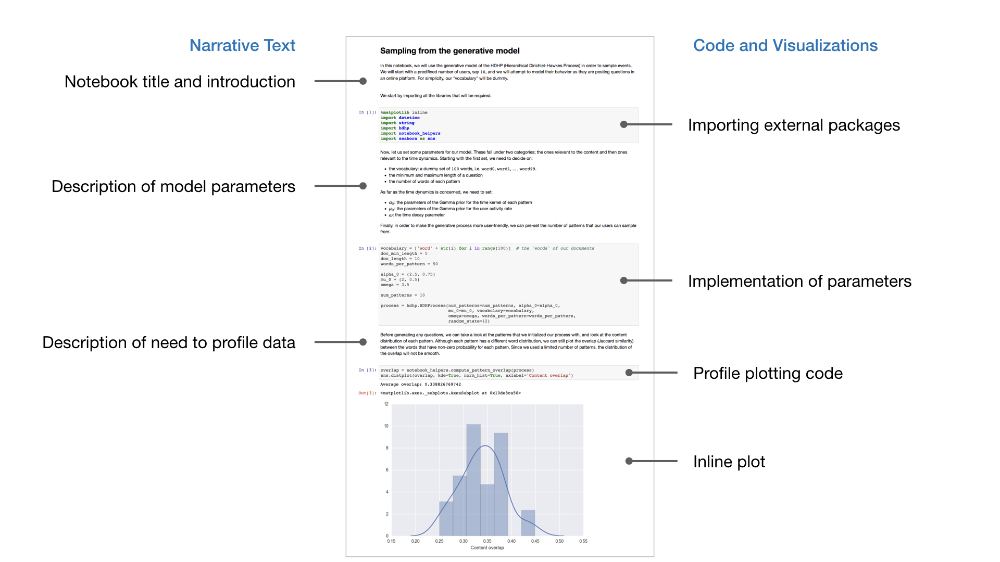

## Installation

[Anaconda] is a free and open-source distribution of the Python
and R programming languages for scientific computing (data science, machine
learning applications, large-scale data processing, predictive analytics,
etc.), that aims to simplify package management and deployment.

[Git] is a distributed version-control system for tracking changes in source
code during software development. It is designed for coordinating work among
programmers, but it can be used to track changes in any set of files.

<a href="https://en.wikipedia.org/"></a><br/>

**Contents**
* [Objectives](#objectives)
* [Installation](#installation) ................................................................................................................................................
  
* [Python, IPython & Jupyter](#python-ipython--jupyter-) .......................................................................................................................
  
* [Testing your installation](#testing-your-installation-) ...........................................................................................................................
  
* [First steps](#first-steps-) .................................................................................................................................................
  


<br/>

## Objectives

The primary goals of this lesson are:

* To ensure you have a clean Python installation (including [Jupyter])
* To install a decent text editor on your system
* To type a few Python lines and to run a python script
  
### Convention 

During this introduction, we'll use three different kind of console, namely
`shell` (or powershell), `Python` and `IPython`. To help you distinguish them,
there will be a small colored icon in front of them:


``` bash
GNU bash, version 3.2.57(1)-release-(x86_64-apple-darwin18)
$ _
```


``` Pycon
Python 3.7.2 (default, Feb 12 2019, 08:15:36)
[Clang 10.0.0 (clang-1000.11.45.5)] on darwin
Type "help", "copyright", "credits" or "license" for more information.
>>> _
```


``` IPython
Python 3.7.2 (default, Feb 12 2019, 08:15:36)
Type 'copyright', 'credits' or 'license' for more information
IPython 7.0.1 -- An enhanced Interactive Python. Type '?' for help.

In [1]: _
```

In the examples above, `>>>` is the Python prompt and does not need to be
typed. For IPython, the prompt is more likely to be something like
`[12]:`. There is also a second prompt (`...`) meaning the previous line is not
ended and needs to be terminated. This is for example the case when you enter a
parenthese or an unbalanced expression (e.g. number of opening parenthesis is
greater than the number of closing parenthesis).

If you type a bash command in a Python shell or a Python command in a Bash
shell, the console will report an error.

> **Note**: to exit a Python shell or a regular shell, you can type `exit()` or
type `Control-D`.


<br/><br/>
## Installation 

As of today (2019), Python exists mainly in two flavors: Python 2.x
(deprecated) and Python 3.x. On some systems, the 2.x version is already
installed and for some systems, the 3.x version might be installed as well (or
instead). However, we cannot use any of them because we'll need to install
several packages that might interfere with the system packages. We'll thus have
to install our own version using [Anaconda] by Continuum Analytics which is a
free Python distribution (including for commercial use and redistribution) and
includes more than 400 of the most popular Python packages for science, math,
engineering, and data analysis.

[Anaconda] is available for several architectures:

* [Anaconda for windows](https://www.anaconda.com/distribution/#windows)
  (Python 3.7 version and the 64-Bit Graphical Installer (614.3 MB))  
* [Anaconda for linux](https://www.anaconda.com/distribution/#linux)
  (Python 3.7 version and the 64-Bit (x86) Installer (652.5 MB)
* [Anaconda for OSX](https://www.anaconda.com/distribution/#macos)
  (Python 3.7 version and the 64-Bit Graphical Installer (652.7 MB))

When asked whether to install Visual Studio, choose yes if you're on Windows.

Once installation has finished, we'll need to test it.  

> **Note** that If you're using a Windows machine, you'll need to install
> [powershell](https://docs.microsoft.com/en-us/powershell/) that let you
> manage your computer from the command line.


You can now open a terminal (or powershell on Windows) and test if you've
access to the `conda` command:


``` bash
$ conda --version
conda 4.5.12
```

Since the installer might not be up to date (depending on when it was build),
you may need to update your anaconda installation:


``` bash
$ conda update --all
Collecting package metadata: done
Solving environment: done

## Package Plan ##

...

Proceed ([y]/n)?

...

Preparing transaction: done
Verifying transaction: done
Executing transaction: done

$ conda --version
conda 4.6.4
```

> **Note**: If the `conda` does not work, you'll need to open the Anaconda
> navigator and to update the packages through the interface. The reason why
> the `conda` does not work might be linked to a `PATH` problem. In such case,
> it might be worth to reboot your machine to see if this solves the problem.


### Git, a distributed version control system 

We now need to install Git which is not related to Python and has not been
installed during the previous step. Depending on your system, it might be
already installed but most probably it is not up to date and this is the reason
why we'll install our own version. Download the version for your system and
proceed with installation:

* [Windows](https://git-scm.com/downloads/win)
* [Linux](https://git-scm.com/download/linux)
* [Mac](https://git-scm.com/download/mac)

Once installation has finished, you can type:


``` bash
$ git --version
2.20.1
```

> **Note**: As for `conda`, this command may not work if your `PATH` has not
> been updated properly. You can try starting a new terminal and/or reboot
> your machine to see if this solves the problem.


### Code editor

The last thing we need to install is a decent code editor. You might have one
already installed on your system and if you're faimilar with it, no need to
install another one. Still, you'll need to configure it properly. If you have
no code editor (or if you're not sure you have one), you need to install
one. There is actually a large choice but I will only list here the most
relevant ones:

* [Atom]
* [Notepad++]
* [Sublime Text]
* [Emacs] (powerful but difficult for a beginner)
* [vim] (powerful but difficult for a beginner)

Whatever the editor you chose, you will need to configure it to **not** use
tabulations but to insert spaces (e.g. 4) when you press the `tab` key. This is
important because if you don't do it and mix spaces and tabulations, Python
will complain (it is not allowed) and using only tabs is generally a bad
idea. The way to configure this is editor dependent so I'll let you search how
to do it in your preferred editor.


<br/><br/>
## Python, IPython & Jupyter 

You are now ready to start using Python and there are several ways to do that:

1. You can start a Python or IPython shell and type some Python commands
2. You can write a Python script and execute it
3. You can start the Jupyter notebook and type some Python code in the browser  
   (and save your code and results in various formats such as PDF or HTML)

The Python shell can be started using the command `python` or `python3`:


``` Pycon
$ Python
Python 3.7.2 (default, Feb 12 2019, 08:15:36)
[Clang 10.0.0 (clang-1000.11.45.5)] on darwin
Type "help", "copyright", "credits" or "license" for more information.
>>> _
```

Once inside the sell, you can start typing command:


``` Pycon
>>> print("Hello world!")
Hello world!
```


The IPython shell can be started using the command `ipython` or `ipython3`:


``` Pycon
$ IPython
Python 3.7.2 (default, Dec 29 2018, 00:00:04)
Type 'copyright', 'credits' or 'license' for more information
IPython 7.2.0 -- An enhanced Interactive Python. Type '?' for help.

In [1]: _
```

It works pretty much like the default Python shell and you can type commands:


``` Pycon
In [1]: print("Hello world!")
Hello world!
```

Both shells allow to enter Python commands, but IPython offers a set of
supplementary commands as well as some goodies such as code completion and
interactive figures. If you don't which one to use, choose IPython (you'll
thank me later).


Using the shell is fine for short code snippets, but as soon as you will want
to write longer program, you'll need first to write your code in a text editor
and then you will execute your code. Let me show you with a very simple script.

Open your text editor and write:

```
print("Hello world!")
```

and save the file as `hello.py`. The `.py` is the regular file extension used
for Python programs. You are free to use any exension you like, but using `.py`
is a good idea since the operating system can identify the file as being a
Python script. 

Take note on where you saved your file because you'll need to go to this place
in the shell in order to be able to run it (you can also use the absolute path
to execute it but it is less convenient.


``` Bash
# Replace the path with the path where you saved your script
$ cd ~/GitHub/scipy-crash-course/examples 
$ python hello.py
Hello world!
```

If you run the above command, Python will terminate as soon as your program
has ended. If you want to stay within the Python interpreter, you'll have to use
the `-i` switch (interactive mode) that tells Python to not exit once the program
has finished.

The IPython shell allows you to run a script through the magic
command `%run` (there are many [other magic commands](https://ipython.org/ipython-doc/3/interactive/magics.html)).


```IPython
In [1]: %run hello.py
Hello world!
```

Last, but not least, you can use the [Jupyter] notebook that is an open-source
web application that allows you to create and share documents that contain live
code, equations, visualizations and narrative text. It's a very powerful tool
and is used by an increasing number of researcher.



If you want to get started with Jupyter notebook, you better read the
[tutorial](https://jupyter.readthedocs.io/en/latest/running.html) at
jupiter.org or this nice
[tutorial](https://www.datacamp.com/community/tutorials/tutorial-jupyter-notebook)
at datacamp.


<br/><br/>
## Testing your installation 


It's now time to check our installation to see if everything is ok.  At this
point, no need yet to understand what you're typing but we need to check if
some important packages are present with the proper version.


**Checking for numpy**


``` pycon
>>> import numpy
>>> print(numpy.__version__)
1.15.2
>>> numpy.test() # This can last a few seconds
..........................
```

**Checking for scipy**


``` pycon
>>> import scipy
>>> print(scipy.__version__)
1.1.0
>>> scipy.test() # This can last several minutes
...........................
```

**Checking for matplotlib**


``` pycon
>>> import matplotlib
>>> print(matplotlib.__version__)
3.0.0
```

**Checking for cython**


``` pycon
>>> import cython
>>> print(cython.__version__)
0.28.2
```

**Checking for numba**


``` pycon
>>> import numba
>>> print(numba.__version__)
0.40.0
>>> numba.test() # This can last several minutes
...........................
```


For each of these packages, the `x.y.z` version should be equal or greater than
the displayed version. If this is not the case, then maybe you conda
installation is not up to date and needs to be upgraded (go back the
[Installation](#installation) section to see how this can be done.


<br/><br/>
## First steps 

Now it's time to experience a little bit with Python. Let's start with simple
arithmetic operations because Python can be used as a regular calculator with
standard arithmetic operations (addition, subtraction, multiplication,
division, etc.)

#### Addition


```pycon
>>> 2 + 3
5
```

#### Subtraction


```pycon
>>> 11 - 3
8
```

#### Multiplication


```pycon
>>> 3 * 4
12
```

#### Division


```pycon
>>> 11 / 5
2.2
```

#### Integer division


```pycon
>>> 11 // 5
2
```

#### Modulo operation


```pycon
>>> 11 % 5
1
```

#### Power


```pycon
>>> 2**3
8
```

Note that you cannot have spaces between digits of a number:


```pycon
>>> 1 0 + 2 
  File "<stdin>", line 1
    1 0 + 2
      ^
SyntaxError: invalid syntax
```

In such a case, Python complains about a syntax error and points at the
position of the error in the expression (using the `^` character). Why Python
points at the zero and not the space ? Because you could have written `1 + 2`
and the space would have been legal. The interpreter can only find the error
after it discovers the extra digit and consequently points at it when reporting
the error.

Of course, you can compose any number of operations in order to compute a more
complex operation:


```pycon
>>> 11 - (5 * (11//5)) #  = 11 % 5
1
```


###  Native numeric types

Python offers natively four main native numeric type, `bool`, `integer`,
`float` and `complex`. But always keep in mind that they are the poor's man
version of their mathematical equivalent (Boolean (𝔹), Integer (ℤ), Real (ℝ)
and Complex (ℂ)): `ìnteger` have limited range, `float` and `complex` have
limited range and precision.

In the case of `float` and `complex`, this has very important consequences.


``` pycon
>>> 0.1 + 0.1 + 0.1 == 0.3
False
```

The reason is that decimal numbers `0.1` and `0.3` cannot be represented
exactly and are only approximated. On most machines, if Python were to print
the actual value of the approximation, it would have to display:


```pycon
>>> print("{0:.64f}".format(0.1))
0.1000000000000000055511151231257827021181583404541015625000000000
>>> print("{0:.64f}".format(0.3))
0.2999999999999999888977697537484345957636833190917968750000000000
```

Consequently, Python (as many other languages) chose to display a rounded value
instead. If you want to know more, have a look at the [Floating Point
Arithmetic: Issues and
Limitations](https://docs.python.org/3/tutorial/floatingpoint.html) chapter in
the official [Python 3
tutorial](https://docs.python.org/3/tutorial/index.html). An immediate and
practical consequence is that what you see in the console is not always what
you get in memory, even if they're reasonably close. If you want to know more
about that, make sur to read [What Every Computer Scientist Should Know About
Floating-Point
Arithmetic](https://docs.oracle.com/cd/E19957-01/806-3568/ncg_goldberg.html),
David Goldberg, Computing Surveys, 1991.


The right way to compare float numbers is thus to check if the difference is
below a given threshold:


``` pycon
>>> (0.1 + 0.1 + 0.1) - 0.3 < 1e-15
True
```


For each type, there exist many ways to specify the same number.


``` pycon
>>> True              # Boolean
>>> 0b1010            # Integer (base  2: binary)
>>> 0o12              # Integer (base  8: octal)
>>> 10                # Integer (base 10: decimal)
>>> 0x0a              # Integer (base 16: hexadecimal)
>>> 10.0              # Float
>>> 1e1               # Float (scientic notation)
>>> float('inf')      # Float (infinity +∞)
>>> float('nan')      # Float (Not A Number: nan)
>>> 10 + 0j           # Complex
```

You can also force the type of a quantity by casting it into a different type:


```pycon
>>> bool(0)
False
>>> int(0)
0
>>> float(0)
0.0
>>> complex(0)
0j
```


### Beyond simple arithmetic

If you want to use more elaborate functions, you'll need the help of the
[mathematical module](https://docs.python.org/3/library/math.html) for real
numbers and the [complex mathematical
module](https://docs.python.org/3/library/cmath.html) for complex numbers. To
do that, we have to `import` a library and to use its name as a prefix, in
front of the functions we want to use. For those who know Python, you might
have been tempted to write `from math import *` but this is almost always a bad
idea.


**Power and logarithmic functions** 


```pycon
>>> import math
>>> math.log( math.exp( 1.234 ) )
1.234
```

**Trigonometric functions**


```pycon
>>> import math
>>> math.asin( math.sin( 1.234 ) )
1.234
```

**Hyperbolic functions**


```pycon
>>> import math
>>> math.asinh( math.sinh( 1.234 ) )
1.234
```

**Special functions**


```pycon
>>> import math
>>> math.gamma( 2.0 )
1.0
```

**Constants**


```pycon
>>> import math
>>> math.pi
3.141592653589793
>>> math.e
2.718281828459045
>>> math.nan # Not A Number
nan
>>> math.inf # Infinite
inf
```


### Logical operations

Logic is an important part of Python because this allows to manipulate and
compare quantities, including numbers, and we'll see later that it works for
all kind of objects.


```pycon
>>> True and True # Logical and
>>> 42 or 57      # Logical or
>>> 1 == 2-1      # Equality test
>>> 1 != 2        # Inequality test
>>> 1 is 2-1      # Identity test
>>> not 24        # Negation
```

Note that the `is` keyword really means identity (the two terms point to the
same object), it is not a test for equality.


```pycon
>>> 1 is 1.0
False
>>> True is 1
False
>>> True and 1
True
```

### Bitwise operations

Bitwise operations are logical operations that operate a the bit level. They
might be useful in some situations but we won't use them much in this course.


```pycon
>>> 1 | 2   # bitwise or
>>> 1 & 2   # bitwise and
>>> 1 ^ 2   # bitwise xor
>>> 8 << 2  # bitwise left shift
>>> 8 >> 2  # bitwise right shift
>>> ~8	  # bitwise negation
```


<br/><br/>
## Exercises

Before moving to the [next lesson](02-introduction.md), here are some simple
exercises that should take you only a few minutes to solve. If you want the
solution, just type these expression in a Python console.


### Find the type of the following expressions

```
.0
-1
1,
'float(4) + 5'
1e2
1j
math.nan
```

### Are these legal Python expressions?

```
1 + 1 == 2
1 = 2
1 + 1i
1 <- 2
0.+.0
3***3
3 <<2>> 3
```

### Find the result of the following expressions

```
1.+.1
0b1+0xb1
(1,)*3
1e1000 - 1e1000
'abc'*3
3 or 10
3 <2 > 3
```


<br/>

---

Copyright © 2019 [Nicolas P. Rougier](http://www.labri.fr/perso/nrougier) •
Released under a [CC-BY 4.0 International](https://creativecommons.org/licenses/by/4.0/legalcode) license.


<!----------------------------- External links ------------------------------->
[Anaconda]:     https://www.anaconda.com
[Python]:       http://www.python.org
[Numpy]:        http://www.numpy.org
[Scipy]:        http://www.scipy.org
[Matplotlib]:   http://matplotlib.org
[IPython]:      http://ipython.org
[Jupyter]:      http://jupyter.org
[Git]:          https://git-scm.com
[Cython]:       http://cython.org
[Unicode]:      https://en.wikipedia.org/wiki/Unicode
[Emacs]:        http://www.emacs.org/
[vim]:          https://www.vim.org/
[Atom]:         https://atom.io/
[Notepad++]:    https://notepad-plus-plus.org/
[Sublime Text]: https://www.sublimetext.com/
<!---------------------------------------------------------------------------->
