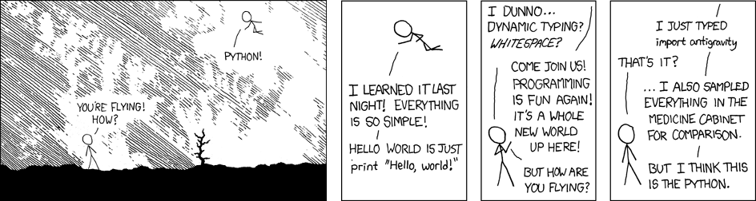

# Scientific Python Crash Course

This is the material for a 20 hours crash course on Scientific Python
that has been split in 5 beginner and 3 advanced
modules. Contributions and feedbacks are welcome. Released under a
[CC-BY 4.0
International](https://creativecommons.org/licenses/by/4.0/legalcode) license.  

   

## Material

### [1. Installation](01-installation.md) 

This lesson aims at providing the student with a clean development environment,
including Python installation and essential packages (using the [Anaconda]
installer), a decent text editor (e.g. [emacs], [vim], [atom], [notepad++]), a
git command line and a shell. We'll also introduce the Python & [IPython]
shells, the [Jupyter] notebook and explains how to run a python
script from the command line or from inside the [IPython] shell.  

**Keywords**: `anaconda`, `shell`, `notebook`, `script`, `git`, `editor`  
**Prerequisites**: None  
**Resources**: None 

 

<!-- ----------------------------------------------------------------------- -->
### [2. Introduction](introduction.md) 

We introduce here the Python language. Only the bare minimum necessary for
getting started with Numpy and Scipy is addressed here. To learn more about
the language, consider going through the excellent tutorial
https://docs.python.org/tutorial. Dedicated books are also available, such as
http://www.diveintopython.net/.  

**Keywords**: `python`, `types`, `control flow`, `function`, `package`  
**Prerequisites**: Installation  
**Resources**: [The Python tutorial](https://docs.python.org/3/tutorial/)

 

<!-- ----------------------------------------------------------------------- -->
### [3. Numerical computing (numpy)](https://scipy-lectures.org/intro/numpy/index.html) 

This lesson gives an overview of [NumPy], the core library for performant
numerical computing, with support for large, multi-dimensional
arrays and matrices, along with a large collection of high-level mathematical
functions to operate on these arrays.

**Keywords**: `numpy`, `array`, `dtype`, `shape`, `broadcast`  
**Prerequisites**: Introduction  
**Resources**: [SciPy Lecture Notes](https://scipy-lectures.org/)

 

<!-- ----------------------------------------------------------------------- -->
### [4. Data visualization (matplotlib)](https://github.com/rougier/matplotlib-tutorial) 

In this lesson, we are going to explore [Matplotlib] that is the single most
used Python package for 2D-graphics. It provides both a very quick way to
visualize data from Python and to produce publication-quality figures in many
different formats. We'll cover only most common use cases.

**Keywords**: `matplotlib`, `figure`, `plot`, `data`  
**Prerequisites**: Introduction, Numerical computing  
**Resources**: [Scientific Visulization: Python + Matplotlib](https://www.labri.fr/perso/nrougier/scientific-visualization.html)

 

<!-- ----------------------------------------------------------------------- -->
### [5. Scientific computing (scipy)]() 

We'll explore the [SciPy] library that contains a large number of independent
modules for optimization, linear algebra, integration, interpolation, special
functions, FFT, signal and image processing, ODE solvers and other tasks common
in science and engineering.

**Keywords**: `linear algebra`, `signal processing`, `analysis`, `integration`, `solvers`  
**Prerequisites**: Numerical Computing  
**Resources**: [SciPy Lecture Notes](https://scipy-lectures.org/)

 

<!-- ----------------------------------------------------------------------- -->
### [6. Version Control (git)](https://swcarpentry.github.io/git-novice/)  

Version control is the lab notebook of the digital world: it’s what
professionals use to keep track of what they’ve done and to collaborate with
other people. Every large software development project relies on it, and most
programmers use it for their small jobs as well. And it isn’t just for
software: books, papers, small data sets, and anything that changes over time
or needs to be shared can and should be stored in a version control system.

**Keywords**: `git`, `github`, `clone`, `commit`, `push`, `fork`  
**Prerequisites**: Installation  
**Resources**: [Software Carpentry](https://software-carpentry.org/)

 

<!-- ----------------------------------------------------------------------- -->
### [7. Vectorization techniques (numpy)](https://www.labri.fr/perso/nrougier/from-python-to-numpy) 

The goal of this lesson is to explain some vectorization techniques that
can drastically improve computation, with several orders of magnitude in
some cases.

**Keywords**: `Code`, `Problem`, `Spatial`, `Temporal`  
**Prerequisites**: Numerical Computing  
**Resources**: [From Python to Numpy](https://www.labri.fr/perso/nrougier/from-python-to-numpy)

 

<!-- ----------------------------------------------------------------------- -->
### [8. Interface with C (cython and ctypes)](https://scipy-lectures.org/advanced/interfacing_with_c/interfacing_with_c.html) 

[Cython] is a static compiler for both the Python programming language and the
extended Cython programming language that eases the writing of C extensions.
[Numba] translates Python functions to optimized machine code at runtime (just in
time) using the industry-standard LLVM compiler library.

**Keywords**: `Optimization`, `Cython`, `Numba`, `Compiler`, `JIT`  
**Prerequisites**: Numerical Computing , Vectorization techniques  
**Resources**: [SciPy Lecture Notes](https://scipy-lectures.org/)

 

### Bibliography
* [SciPy 1.0: fundamental algorithms for scientific computing in Python](https://www.nature.com/articles/s41592-019-0686-2),  
P.Virtanen, R.Gommers & al., Nature Methods, 2020.
* [Array programming with NumPy](https://www.nature.com/articles/s41586-020-2649-2),   
C.R. Harris, K.J. Millman & al., Nature, 2020.
* [How to transform code into scientific contribution](https://www.frontiersin.org/articles/10.3389/fninf.2017.00069/full),  
N.P. Rougier & F.Benureau, Frontiers in Neuroinformatics, 2018.
* [Ten simple rules for better figures](https://journals.plos.org/ploscompbiol/article?id=10.1371/journal.pcbi.1003833),  
N.P. Rougier, M. Droettboom & P. E. Bourne, Plos Computational Biology, 2014.

### Copyright notice

Copyright © 2021 [Nicolas P. Rougier](http://www.labri.fr/perso/nrougier) —
Released under a [CC-BY 4.0 International](https://creativecommons.org/licenses/by/4.0/legalcode) license.  
Banner image copyright © Randall Monroe ([XKCD #353](https://xkcd.com/353/)) — 
This course has been written in November 2021 using:  
        

[Anaconda]:   https://www.anaconda.com/
[Emacs]:      http://www.emacs.org/
[vim]:        https://www.vim.org/
[Atom]:       https://atom.io/
[Notepad++]:  https://notepad-plus-plus.org/
[IPython]:    http://www.ipython.org/
[Jupyter]:    http://www.jupyter.org/
[NumPy]:      http://www.numpy.org/
[Scipy]:      http://www.scipy.org/
[Matplotlib]: http://www.matplotlib.org/
[Cython]:     https://cython.org/
[Numba]:      https://numba.pydata.org/
